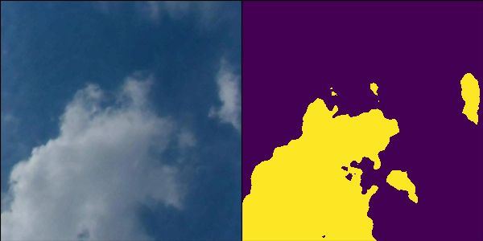
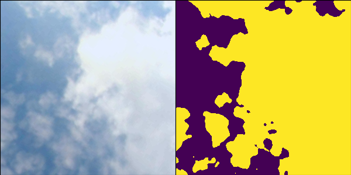
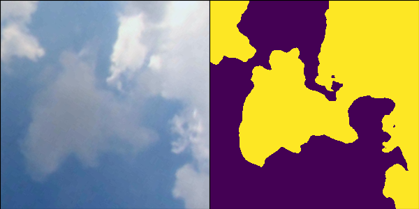
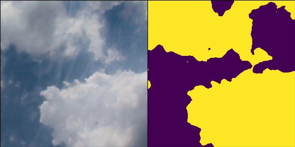

# DFANet for segmentation of cloud images
______________________________________________

基于DFANet:Deep Feature Aggregation for Real-Time Semantic Segmentation (CVPR2019)深度特征聚合网络的地基云图分割。因为文章代码暂时还没有开源，所以复现的网络在细节上可能有一些问题。iou在0.87～0.88之间，F1，P，R，Acc在0.93左右。输入600x600大小的云图，显卡为GTX2080的条件下FPS约为100。保存的模型大小为7.8m。
结果如下图右侧图为预测值：






## 1.环境要求
    Python 3.6
    numpy
    scipy
    Pillow
    cython
    matplotlib
    scikit-image
    pytorch1.0
    opencv-python
    h5py
    imgaug
    IPython[all]
## 2文件结构
```
project 
  |--README.md  
  |--data/
  |--model/
  |--result/
  |--main.py
  |--config.py
  |--data.py
  |--detection.py

```
 ### 2.1文件目录说明
 * data存放训练数据。。
 * result存放测试图。
 * log 存放训练的模型
 ## 4.如何训练
 * 命令行运行de_main.py
 * 训练完成之后运行detection.py执行检测任务
